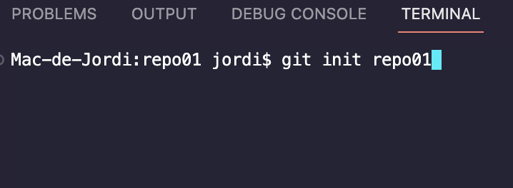

# Ejercicios GIT-Markdown  
## Ejercicio 1  
### 1.1  
Primeramente deberemos instalar GIT en nuestro ordenador, una vez instalado abriremos el terminal de nuestra máquina e introduciremos el comando _pwd_ para ver la ruta que va a seguir nuestro directorio. Si introducimos el comando _ls_ podremos ver en una lista todo el contenido del que dispone la ruta.   

Nuestro siguiente paso será crear un directorio de forma local, para eso escribiremos en nuestro terminal el comando _mkdir repo01_.  
### 1.2
Para documentar todos los pasos de este ejercicio, crearemos dentro de nuestro repositorio un archivo llamado _README.md_ (la terminación _.md_ significa que estamos trabajando con Markdown)  
### 1.3  
Para crear en un fichero dentro de nuestro repositorio deberemos introducir en nuestro terminal el siguiente comando _git init repo01_, de esta manera ya tendremos creado un fichero de _.git_. Seguidamente 